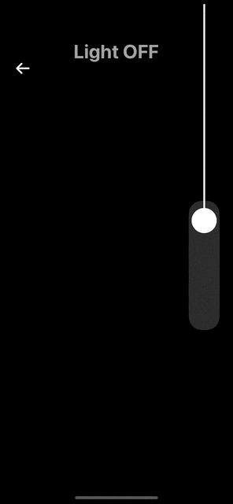

# **LightSwitchView App**

An interactive light switch app built using SwiftUI. This project demonstrates the use of animations, gestures, and dynamic scaling to simulate a real-life light switch turning on and off, creating a visually appealing and functional design.

  
*(Replace with an animated GIF or screenshot showcasing the app in action.)*  

---

## **Features**
- Interactive toggle animation for turning the light ON/OFF.
- Smooth transitions using `withAnimation` and `spring` effects.
- Custom-designed switch mechanism with gestures.
- Dynamic text and background changes to enhance user experience.

---

## **Technologies Used**
- **Framework:** SwiftUI  
- **Language:** Swift  
- **IDE:** Xcode  

---

## **Getting Started**

### **Installation**
1. Clone the repository:  
   ```bash
   git clone https://github.com/yourusername/LightSwitchView.git
   cd LightSwitchView
   ```
2. Open the project in Xcode:  
   ```bash
   open LightSwitchView.xcodeproj
   ```
3. Build and run the project on a simulator or a real device.  

---

## **How It Works**

### **Core Components**
1. **Light Bulb:**
   - A `Circle` view scaled dynamically based on the light's state (`isOff`).
2. **Switch Mechanism:**
   - A combination of `Capsule` and `Circle` with `onTapGesture` to toggle the light.
3. **State Management:**
   - `@State` is used to track whether the light is ON or OFF.
4. **Animations:**
   - Smooth transitions are implemented using `.spring()` and `.easeIn`.

### **Code Snippet (Toggle Function)**
```swift
func toggleAllLight() {
    withAnimation(Animation.easeIn(duration: animationDuration)) {
        if isOff {
            xScale = 4
            yScale = 4
            yOffset = 0
        } else {
            xScale = 2
            yScale = 0.4
            yOffset = UIScreen.main.bounds.height * 0.8
        }
        isOff.toggle()
    }
}
```

---

## **Demo**

  
*(Include an animated GIF or screenshots to demonstrate the app functionality.)*  

---

## **Customization**

### **Adjust Animation Speed**
Modify the `animationDuration` property to control the speed of the light toggle animation:
```swift
let animationDuration: TimeInterval = 0.5
```

### **Change Light Colors**
Customize the light's ON and OFF colors by modifying the `Color` properties in the `Circle` view:
```swift
.fill(isOff ? Color.black : Color.yellow)
```

---

## **Contribution**
Contributions are welcome! Feel free to fork this repository, submit pull requests, or open issues to suggest improvements.

---

## **License**
This project is licensed under the MIT License. See the [LICENSE](LICENSE) file for details.

---

## **Contact**
For questions, feel free to reach out:  
📧 Email: [shahriar.hossain.dev@gmail.com](mailto:shahriar.hossain.dev@gmail.com)  
🔗 LinkedIn: [Shahriar Hossain](https://www.linkedin.com/in/shahriar-hossain-dev/)  
🔗 YouTube: [Shahriar Hossain](https://www.linkedin.com/in/shahriar-hossain-dev/)  

---

Let me know if you'd like me to help with adding a GIF demo or tweaking any section further!
